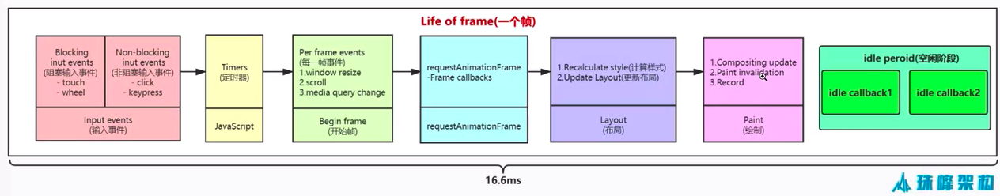

常见显示器的刷新率 FPS is 60 Frame per Second

每一帧的时间 = 1000 / 60 = 16.66 ms, 一帧的工作时间不超过16 ms

Life of frame

Javascript Engine 和 页面渲染Engine在同一个Thread

The window.requestAnimationFrame() method tells the browser that you wish to perform an animation and requests that the browser calls a specified function to update an animation before the next repaint.

The window.requestIdleCallback() method queues a function to be called during a browser's idle periods. 
This enables developers to perform background and low priority work on the main event loop, without impacting latency-critical events such as animation and input response.

